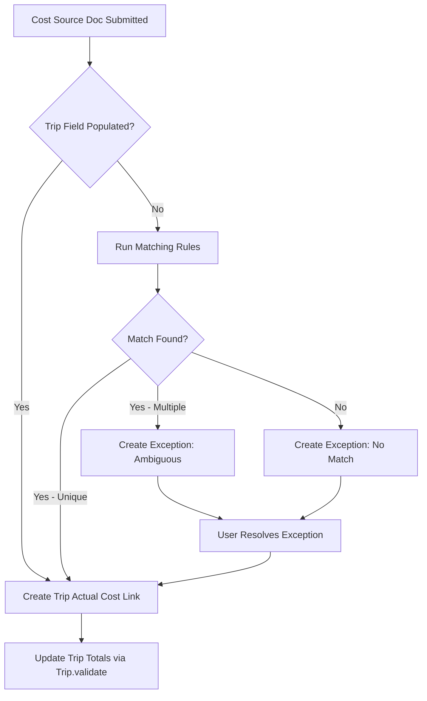
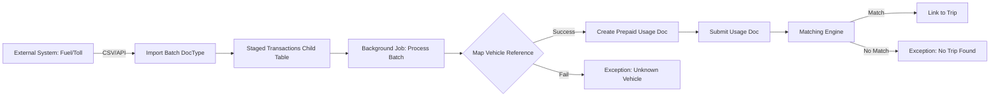
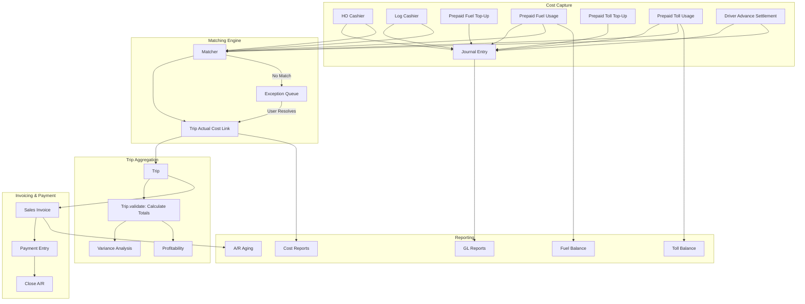
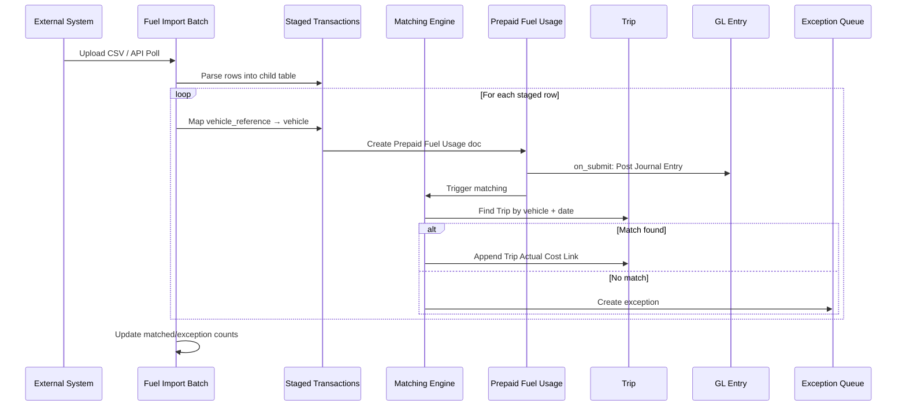
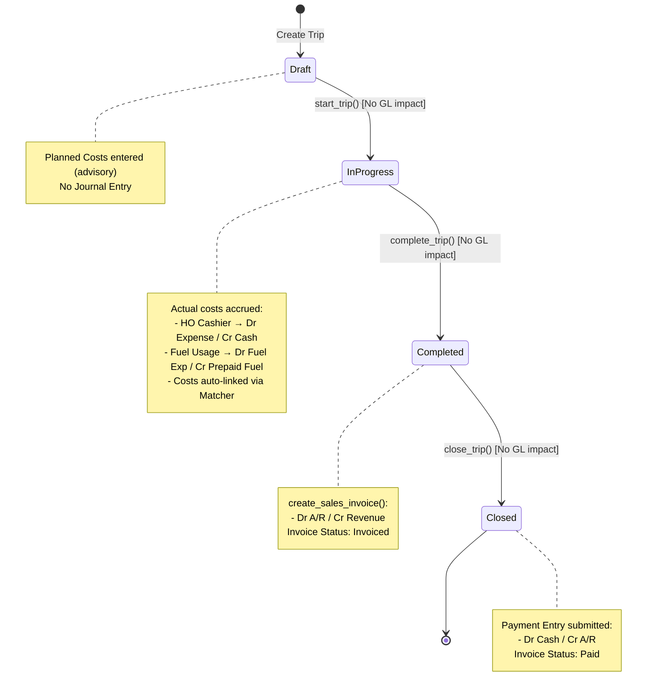

Now I have enough context. Let me produce the comprehensive implementation blueprint.

---

# Logistics ERP Evolution: Implementation Blueprint

## Executive Summary

This blueprint transforms the existing `transport` app from a spreadsheet-based cost tracker into a proper Logistics ERP with source-attributed costing, immutable accounting integration, and comprehensive financial reporting. The migration preserves existing Trip and Transport Order functionality while introducing:

- 8 new cost source DocTypes (cash, prepaid fuel/toll, driver advances)
- Cost matching engine with exception queue
- Automatic Journal Entry posting to ERPNext GL
- Fuel/toll import pipeline with idempotency
- Enhanced Trip profitability based on linked source documents

**Key architectural principle:** Every transaction with accounting impact creates an immutable Journal Entry/Payment Entry/Sales Invoice. Trip budgeting remains advisory (no GL impact). All reports query the same transaction data that feeds the GL.

---

## 1. DocType Inventory

### 1.1 Foundation & Configuration

#### 1.1.1 Transport Expense Category (NEW)
**Purpose:** Master list of expense categories with GL account mappings per company.

**File:** `/workspace/frappe/apps/transport/transport/transport/doctype/transport_expense_category/`

**Key Fields:**
- `category_name` (Data, unique, primary key) - e.g., "Diesel/Fuel", "Toll Fees", "Driver Allowance"
- `category_type` (Select) - "Variable", "Fixed", "Driver-Related"
- `is_active` (Check)
- `account_mappings` (Table: Transport Expense Category Account)
  - `company` (Link: Company)
  - `expense_account` (Link: Account) - GL account for this expense in this company
  - `default_cost_center` (Link: Cost Center)

**Submittable:** No (simple master)

**Rationale:** Replaces hardcoded "Diesel/Fuel\nToll Fees..." in Trip Planned Cost and Trip Actual Cost. Centralizes account mappings so HO Cashier/Log Cashier/etc. know which GL account to debit.

---

#### 1.1.2 Transport Settings (NEW)
**Purpose:** Global configuration for the Transport module.

**File:** `/workspace/frappe/apps/transport/transport/transport/doctype/transport_settings/`

**Key Fields:**
- `default_cash_account` (Link: Account) - For HO/Log Cashier payments
- `prepaid_fuel_account` (Link: Account) - Asset account for prepaid fuel top-ups
- `prepaid_toll_account` (Link: Account) - Asset account for prepaid toll top-ups
- `driver_advance_account` (Link: Account) - Asset account for driver advances
- `transport_revenue_account` (Link: Account) - Revenue account for sales invoices
- `default_receivable_account` (Link: Account) - A/R account
- `enable_auto_matching` (Check) - Enable/disable automatic cost matching
- `matching_rule_order` (Small Text) - JSON config for matching priority
- `fuel_import_api_endpoint` (Data) - External fuel system URL
- `toll_import_api_endpoint` (Data) - External toll system URL

**Submittable:** No (singleton settings)

**Rationale:** Single source of truth for account mappings and module behavior. ERPNext's Company-level defaults don't fit multi-dimensional transport logic. This allows per-company overrides via expense category mappings while keeping global defaults here.

---

### 1.2 Cost Source DocTypes (Operational, Submittable)

All cost source DocTypes follow the same pattern:
- **Submittable** (docstatus 0/1/2): Draft → Submitted (posts to GL) → Cancelled (reversal entry)
- **on_submit**: Creates Journal Entry/Payment Entry
- **on_cancel**: Creates reversal Journal Entry with negative amounts

---

#### 1.2.1 HO Cashier Entry (NEW)
**Purpose:** Head-office cash expense payment or driver advance issuance.

**File:** `/workspace/frappe/apps/transport/transport/transport/doctype/ho_cashier_entry/`

**Key Fields:**
- `naming_series` (Select) - "HO-CASH-.YYYY.-.#####"
- `posting_date` (Date, reqd)
- `entry_type` (Select) - "Expense Payment", "Driver Advance Issue"
- `trip` (Link: Trip, depends_on: entry_type == "Expense Payment")
- `vehicle` (Link: Truck, reqd)
- `driver` (Link: Driver, reqd)
- `expense_category` (Link: Transport Expense Category, depends_on: entry_type == "Expense Payment")
- `amount` (Currency, reqd)
- `payment_mode` (Link: Mode of Payment, default="Cash")
- `reference_number` (Data) - cheque/ref
- `description` (Small Text)
- `cash_account` (Link: Account, default from Transport Settings)
- `journal_entry` (Link: Journal Entry, read_only) - Stamped on submit
- `accounting_status` (Select) - "Pending", "Posted", "Cancelled"

**Submittable:** Yes

**Accounting Hook (on_submit):**
```
If entry_type == "Expense Payment":
  Dr Expense Account (from expense_category → company mapping)
  Cr Cash Account (from Transport Settings or overridden)
  
If entry_type == "Driver Advance Issue":
  Dr Driver Advance Account (asset)
  Cr Cash Account
```

**Cost Attribution Fields:** `trip`, `vehicle`, `driver`, `expense_category`, `ho_cashier_entry` (self-reference for matching engine)

**Matching:** If `trip` is set, the matching engine auto-links this entry to Trip Actual Cost. If `trip` is blank (e.g., advance issued before trip assignment), it lands in Exception Queue.

---

#### 1.2.2 Log Cashier Entry (NEW)
**Purpose:** Site-level/log-level cash expenses (e.g., driver pays at pump, logs receipt at depot).

**File:** `/workspace/frappe/apps/transport/transport/transport/doctype/log_cashier_entry/`

**Key Fields:** Identical structure to HO Cashier Entry, except:
- `naming_series` - "LOG-CASH-.YYYY.-.#####"
- `site` (Link: Warehouse or custom "Site" master, optional) - Which depot/site logged this
- `receipt_attachment` (Attach) - Scanned receipt

**Submittable:** Yes

**Accounting Hook:** Same as HO Cashier Entry (Dr Expense / Cr Cash).

**Rationale:** Separated from HO Cashier Entry to allow different permissions (site users can only log their own site's entries) and to track which site generated the cost.

---

#### 1.2.3 Prepaid Fuel Top-Up (NEW)
**Purpose:** Company loads money into prepaid fuel account (e.g., fleet card top-up).

**File:** `/workspace/frappe/apps/transport/transport/transport/doctype/prepaid_fuel_topup/`

**Key Fields:**
- `naming_series` - "FUEL-TOP-.YYYY.-.#####"
- `posting_date` (Date)
- `amount` (Currency)
- `payment_mode` (Link: Mode of Payment)
- `bank_account` (Link: Account, depends_on: payment_mode != "Cash")
- `reference_number` (Data)
- `prepaid_fuel_account` (Link: Account, default from Transport Settings)
- `journal_entry` (Link: Journal Entry, read_only)
- `accounting_status` (Select)

**Submittable:** Yes

**Accounting Hook:**
```
Dr Prepaid Fuel Account (asset)
Cr Cash-Bank Account
```

**Rationale:** Top-up is just an asset transfer (cash → prepaid fuel). No expense recognition until fuel is consumed.

---

#### 1.2.4 Prepaid Fuel Usage (NEW, Standalone DocType)
**Purpose:** Records fuel consumption against a trip, reduces prepaid balance.

**File:** `/workspace/frappe/apps/transport/transport/transport/doctype/prepaid_fuel_usage/`

**Key Fields:**
- `naming_series` - "FUEL-USE-.YYYY.-.#####"
- `posting_date` (Date)
- `trip` (Link: Trip, reqd)
- `vehicle` (Link: Truck, reqd)
- `driver` (Link: Driver, reqd)
- `fuel_quantity_liters` (Float)
- `fuel_cost` (Currency, reqd)
- `expense_category` (Link: Transport Expense Category, default="Diesel/Fuel")
- `external_reference` (Data, unique) - From external fuel system
- `import_batch` (Link: Fuel Import Batch, read_only)
- `journal_entry` (Link: Journal Entry, read_only)
- `match_status` (Select) - "Pending", "Matched", "Exception"

**Submittable:** Yes

**Accounting Hook:**
```
Dr Fuel Expense Account (from expense_category)
Cr Prepaid Fuel Account
```

**Cost Attribution:** `trip`, `vehicle`, `driver`, `expense_category`, `prepaid_fuel_usage` (self-reference)

**Matching:** External fuel system provides `vehicle` + `transaction_date` + `external_reference`. Matching engine finds the Trip by vehicle + date overlap. If no match, row goes to Exception Queue.

---

#### 1.2.5 Prepaid Toll Top-Up (NEW)
**Purpose:** Load money into prepaid toll account (e.g., FASTag recharge).

**File:** `/workspace/frappe/apps/transport/transport/transport/doctype/prepaid_toll_topup/`

**Key Fields:** Identical to Prepaid Fuel Top-Up, swap "fuel" → "toll".
- `naming_series` - "TOLL-TOP-.YYYY.-.#####"
- `prepaid_toll_account` (Link: Account)

**Submittable:** Yes

**Accounting Hook:**
```
Dr Prepaid Toll Account
Cr Cash-Bank
```

---

#### 1.2.6 Prepaid Toll Usage (NEW)
**Purpose:** Records toll consumption against a trip.

**File:** `/workspace/frappe/apps/transport/transport/transport/doctype/prepaid_toll_usage/`

**Key Fields:** Identical to Prepaid Fuel Usage, swap "fuel" → "toll".
- `naming_series` - "TOLL-USE-.YYYY.-.#####"
- `toll_plaza_name` (Data)
- `toll_cost` (Currency)
- `expense_category` (Link: Transport Expense Category, default="Toll Fees")
- `external_reference` (Data, unique)
- `import_batch` (Link: Toll Import Batch, read_only)

**Submittable:** Yes

**Accounting Hook:**
```
Dr Toll Expense Account
Cr Prepaid Toll Account
```

---

#### 1.2.7 Driver Advance Settlement (NEW)
**Purpose:** Driver returns from trip with receipts; advance is settled against actual expenses.

**File:** `/workspace/frappe/apps/transport/transport/transport/doctype/driver_advance_settlement/`

**Key Fields:**
- `naming_series` - "DRV-SETTLE-.YYYY.-.#####"
- `posting_date` (Date)
- `trip` (Link: Trip, reqd)
- `driver` (Link: Driver, reqd)
- `vehicle` (Link: Truck, reqd)
- `advance_entries` (Table: Driver Advance Settlement Detail)
  - `ho_cashier_entry` (Link: HO Cashier Entry) - The advance issue entry
  - `advance_amount` (Currency, read_only, fetched from HO entry)
  - `expense_category` (Link: Transport Expense Category)
  - `actual_expense` (Currency) - Driver spent this much
  - `variance` (Currency, read_only) - advance_amount - actual_expense
  - `receipt_attachment` (Attach)
- `total_advance` (Currency, read_only)
- `total_expense` (Currency, read_only)
- `net_refund_or_shortfall` (Currency, read_only) - If positive, driver owes company; if negative, company owes driver
- `journal_entry` (Link: Journal Entry, read_only)
- `accounting_status` (Select)

**Submittable:** Yes

**Accounting Hook:**
```
For each row in advance_entries:
  Dr Expense Account (from expense_category)
  Cr Driver Advance Account (reverse the advance)
  
If net_refund_or_shortfall != 0:
  Additional entry to settle the difference (Dr/Cr Cash or Driver Payable)
```

**Cost Attribution:** Each row links to `trip`, `vehicle`, `driver`, `expense_category`, `driver_advance_settlement` (self-reference).

**Rationale:** This is the missing piece in the current architecture. Today there's no concept of driver advances. This DocType ties the advance issuance (HO Cashier Entry) to the settlement, ensuring the asset account (Driver Advance) is cleared when expenses are recognized.

---

### 1.3 Import Pipeline DocTypes

#### 1.3.1 Fuel Import Batch (NEW)
**Purpose:** Idempotent staging for external fuel transactions.

**File:** `/workspace/frappe/apps/transport/transport/transport/doctype/fuel_import_batch/`

**Key Fields:**
- `naming_series` - "FUEL-IMP-.YYYY.-.#####"
- `import_date` (Datetime, default=now)
- `import_method` (Select) - "File Upload", "API Polling", "Webhook"
- `file_attachment` (Attach, depends_on: method=="File Upload")
- `imported_by` (Link: User, default=__user)
- `total_records` (Int, read_only)
- `matched_records` (Int, read_only)
- `exception_records` (Int, read_only)
- `import_status` (Select) - "Draft", "Processing", "Completed", "Failed"
- `staged_transactions` (Table: Fuel Staged Transaction)
  - `external_reference` (Data, unique in combination with batch)
  - `transaction_datetime` (Datetime)
  - `vehicle_reference` (Data) - External system's vehicle ID
  - `vehicle` (Link: Truck, read_only) - Resolved via mapping
  - `fuel_quantity_liters` (Float)
  - `fuel_cost` (Currency)
  - `fuel_station_name` (Data)
  - `match_status` (Select) - "Pending", "Matched", "Exception"
  - `trip` (Link: Trip, read_only) - Set by matching engine
  - `prepaid_fuel_usage` (Link: Prepaid Fuel Usage, read_only) - Created doc reference

**Submittable:** No (processing state machine)

**Workflow:**
1. User uploads CSV or system polls API → creates Fuel Import Batch (Draft).
2. Background job parses CSV, populates `staged_transactions` child table.
3. Matching engine iterates rows: map `vehicle_reference` → `vehicle`, find Trip by vehicle + date range, create Prepaid Fuel Usage doc (draft), submit it.
4. If mapping or matching fails, mark row as Exception.
5. Update `matched_records` / `exception_records` counts.

**Idempotency:** `external_reference` + `batch` combo is unique. Re-importing the same file skips already-processed references.

---

#### 1.3.2 Toll Import Batch (NEW)
**Purpose:** Identical to Fuel Import Batch, swap "fuel" → "toll".

**File:** `/workspace/frappe/apps/transport/transport/transport/doctype/toll_import_batch/`

**Key Fields:** Same structure, replace fuel-specific fields with toll-specific.
- `staged_transactions` → Table: Toll Staged Transaction
- `prepaid_toll_usage` (Link)

---

### 1.4 Matching & Exception Handling

#### 1.4.1 Cost Matching Rule (NEW, Settings)
**Purpose:** Define matching logic order and thresholds.

**File:** `/workspace/frappe/apps/transport/transport/transport/doctype/cost_matching_rule/`

**Key Fields:**
- `rule_name` (Data)
- `priority` (Int) - Lower = higher priority
- `match_by` (Select) - "Vehicle + Date Range", "Route + Date Range", "External Reference", "Manual Assignment"
- `date_tolerance_days` (Int) - Allow ±N days overlap
- `is_active` (Check)

**Submittable:** No (master)

**Usage:** Matching engine reads active rules in priority order. For each unmatched cost source row:
1. Try "Vehicle + Date Range": Find Trips where `trip.vehicle == cost.vehicle AND cost.posting_date BETWEEN trip.planned_start_date - tolerance AND trip.actual_end_date + tolerance`.
2. If multiple matches, prefer trip with status="In Progress" over "Draft".
3. If still ambiguous, move to Exception Queue.
4. "Manual Assignment" always goes to Exception Queue (user must select trip).

---

#### 1.4.2 Transport Cost Exception (NEW, Standalone DocType)
**Purpose:** Queue of unmatched cost rows awaiting manual review.

**File:** `/workspace/frappe/apps/transport/transport/transport/doctype/transport_cost_exception/`

**Key Fields:**
- `naming_series` - "COST-EXC-.#####"
- `exception_date` (Datetime, default=now)
- `source_doctype` (Select) - "Prepaid Fuel Usage", "Prepaid Toll Usage", "HO Cashier Entry", "Log Cashier Entry"
- `source_document` (Dynamic Link, linked to source_doctype)
- `vehicle` (Link: Truck, read_only, fetched)
- `driver` (Link: Driver, read_only, fetched)
- `posting_date` (Date, read_only, fetched)
- `amount` (Currency, read_only, fetched)
- `exception_reason` (Text) - Auto-filled by matching engine: "No trips found for vehicle X on date Y"
- `resolution_status` (Select) - "Open", "Resolved", "Ignored"
- `assigned_trip` (Link: Trip) - User manually assigns
- `resolved_by` (Link: User)
- `resolved_on` (Datetime)

**Submittable:** No (operational queue)

**Workflow:**
1. Matching engine creates exception row when it can't auto-match.
2. User opens "Transport Cost Exception" list, filters "Open".
3. User clicks into exception, reviews source document, manually sets `assigned_trip`.
4. On save, system creates Trip Actual Cost Link (see 1.5.1) tying the source document to the trip.
5. Exception status → "Resolved".

---

### 1.5 Trip Changes (Existing DocType MODIFIED)

#### 1.5.1 Trip Actual Cost Link (NEW, Child Table replacing Trip Actual Cost)
**Purpose:** Replace free-typed child table with links to source documents.

**File:** `/workspace/frappe/apps/transport/transport/transport/doctype/trip_actual_cost_link/`

**Key Fields:**
- `source_doctype` (Select) - "HO Cashier Entry", "Log Cashier Entry", "Prepaid Fuel Usage", "Prepaid Toll Usage", "Driver Advance Settlement"
- `source_document` (Dynamic Link, reqd)
- `posting_date` (Date, read_only, fetched)
- `expense_category` (Link: Transport Expense Category, read_only, fetched)
- `vehicle` (Link: Truck, read_only, fetched)
- `driver` (Link: Driver, read_only, fetched)
- `actual_amount` (Currency, read_only, fetched from source doc)
- `planned_amount` (Currency, read_only, calculated from trip.planned_costs by matching expense_category)
- `variance` (Currency, read_only, = actual - planned)
- `journal_entry` (Link: Journal Entry, read_only, fetched from source doc)

**Rationale:** This replaces the old `Trip Actual Cost` child table. Now, actual costs are NOT free-typed. They are links to submitted source documents. The matching engine populates this table automatically. Trip.validate() reads this table to compute totals.

**Migration Note:** Existing `actual_costs` rows must be backfilled as "Manual Entry" type (see section 9).

---

#### 1.5.2 Trip (EXISTING DocType MODIFIED)
**File:** `/workspace/frappe/apps/transport/transport/transport/doctype/trip/trip.json` and `.py`

**Changes to trip.json:**
- Rename `actual_costs` (Table) → `actual_costs_legacy` (hidden, for migration only)
- Add `actual_cost_links` (Table: Trip Actual Cost Link)
- Add `invoice_status` (Select) - "Not Invoiced", "Invoiced", "Paid" (read_only, updated by Sales Invoice / Payment Entry hooks)
- Add `payment_entry` (Link: Payment Entry, read_only) - Link to payment received
- Keep `sales_invoice` (already exists)

**Changes to trip.py:**

```python
def validate(self):
    self.validate_transport_order()
    self.calculate_planned_totals()
    self.calculate_actual_costs_from_links()  # NEW: replaces calculate_actual_costs
    self.calculate_variance()
    self.calculate_profitability()

def calculate_actual_costs_from_links(self):
    """Recalculate totals from linked source documents."""
    planned_map = {row.expense_category: flt(row.planned_amount) for row in self.planned_costs}
    
    total_actual = 0
    for link in self.actual_cost_links:
        # Fetch from source document (already submitted, so amount is immutable)
        link.planned_amount = planned_map.get(link.expense_category, 0)
        link.variance = flt(link.actual_amount) - flt(link.planned_amount)
        total_actual += flt(link.actual_amount)
    
    self.total_actual_cost = total_actual
```

**New Method:**
```python
@frappe.whitelist()
def refresh_cost_links(self):
    """Re-run matching engine for this trip (manual re-match)."""
    from transport.cost_matching.matcher import rematch_trip_costs
    rematch_trip_costs(self.name)
    self.reload()
```

**create_sales_invoice() Enhancement:**
- Change `item_name` to use actual Transport Settings revenue account.
- Add validation: Trip must be "Completed" or "Closed" to invoice.
- Set `self.invoice_status = "Invoiced"` after SI creation.
- Add hook to listen for SI submission/cancellation to update invoice_status.

**Submittable Decision:** Keep Trip as **non-submittable** (docstatus always 0). Status field drives workflow. This is intentional — Trip is a container; the source documents are submittable and post to GL. Trip just aggregates.

---

#### 1.5.3 Trip Planned Cost (EXISTING Child Table MODIFIED)
**File:** `/workspace/frappe/apps/transport/transport/transport/doctype/trip_planned_cost/trip_planned_cost.json`

**Changes:**
- Replace `cost_type` (Select with hardcoded options) → `expense_category` (Link: Transport Expense Category)
- Rename `planned_amount` → `planned_amount` (keep same, just for consistency)

**Rationale:** Planned costs remain advisory (no GL impact). But now they use the master expense category list, ensuring consistency with actual costs.

---

### 1.6 Invoice & Payment Flow (ERPNext DocTypes + Hooks)

**No new DocTypes.** Reuse ERPNext's:
- **Sales Invoice** (already created by Trip.create_sales_invoice)
- **Payment Entry** (ERPNext standard)

**New Hooks in trip.py:**

```python
# Listen for Sales Invoice submission
def on_sales_invoice_submit(doc, method):
    if doc.doctype == "Sales Invoice" and doc.get("trip"):
        trip = frappe.get_doc("Trip", doc.trip)
        trip.invoice_status = "Invoiced"
        trip.sales_invoice = doc.name
        trip.save(ignore_permissions=True)

# Listen for Payment Entry submission (payment against SI)
def on_payment_entry_submit(doc, method):
    if doc.doctype == "Payment Entry" and doc.references:
        for ref in doc.references:
            if ref.reference_doctype == "Sales Invoice":
                si = frappe.get_doc("Sales Invoice", ref.reference_name)
                if si.get("trip"):
                    trip = frappe.get_doc("Trip", si.trip)
                    trip.invoice_status = "Paid"
                    trip.payment_entry = doc.name
                    trip.save(ignore_permissions=True)
```

**Register in hooks.py:**
```python
doc_events = {
    "Sales Invoice": {
        "on_submit": "transport.transport.doctype.trip.trip.on_sales_invoice_submit",
    },
    "Payment Entry": {
        "on_submit": "transport.transport.doctype.trip.trip.on_payment_entry_submit",
    },
}
```

---

## 2. Cost Source Design Summary

All cost sources follow the **submittable pattern**:

| DocType | Entry Type | Dr Account | Cr Account | Source Link Field |
|---------|-----------|------------|------------|-------------------|
| HO Cashier Entry | Expense | Expense (category) | Cash | `ho_cashier_entry` |
| HO Cashier Entry | Advance | Driver Advance | Cash | `ho_cashier_entry` |
| Log Cashier Entry | Expense | Expense (category) | Cash | `log_cashier_entry` |
| Prepaid Fuel Top-Up | Top-Up | Prepaid Fuel | Cash-Bank | N/A (no cost yet) |
| Prepaid Fuel Usage | Usage | Fuel Expense | Prepaid Fuel | `prepaid_fuel_usage` |
| Prepaid Toll Top-Up | Top-Up | Prepaid Toll | Cash-Bank | N/A (no cost yet) |
| Prepaid Toll Usage | Usage | Toll Expense | Prepaid Toll | `prepaid_toll_usage` |
| Driver Advance Settlement | Settlement | Expense (category) | Driver Advance | `driver_advance_settlement` |

**Accounting Hook Pattern:**
All cost source `.py` files implement:

```python
def on_submit(self):
    self.post_journal_entry()
    self.accounting_status = "Posted"

def post_journal_entry(self):
    from transport.accounting.journal_entry_helper import create_transport_journal_entry
    je = create_transport_journal_entry(
        voucher_type="Journal Entry",
        posting_date=self.posting_date,
        accounts=[
            {"account": self.get_debit_account(), "debit_in_account_currency": self.amount},
            {"account": self.get_credit_account(), "credit_in_account_currency": self.amount},
        ],
        user_remark=f"{self.doctype} {self.name}",
        reference_type=self.doctype,
        reference_name=self.name,
    )
    self.journal_entry = je.name

def on_cancel(self):
    if self.journal_entry:
        je = frappe.get_doc("Journal Entry", self.journal_entry)
        je.cancel()
    self.accounting_status = "Cancelled"
```

**Helper Module:** `/workspace/frappe/apps/transport/transport/accounting/journal_entry_helper.py` centralizes Journal Entry creation logic. It validates account mappings, sets company/cost center, and handles ERPNext's Journal Entry quirks (party, reference fields).

---

## 3. Matching Engine Design

### 3.1 Architecture

**Location:** `/workspace/frappe/apps/transport/transport/cost_matching/matcher.py`

**Entry Points:**
1. **Automatic (on source doc submit):** Each cost source's `on_submit` calls `matcher.match_to_trip(doctype, docname)`.
2. **Batch (import pipeline):** Fuel/Toll Import Batch calls `matcher.match_import_batch(batch_name)`.
3. **Manual (user-triggered):** Trip form button "Refresh Cost Links" calls `matcher.rematch_trip_costs(trip_name)`.

**Data Flow:**



### 3.2 Matching Rules (Ordered Priority)

1. **Explicit Trip Link**: If source doc already has `trip` field set, skip rules, directly link.
2. **Vehicle + Date Overlap**: `source.vehicle == trip.truck AND source.posting_date BETWEEN (trip.planned_start_date - tolerance, trip.actual_end_date + tolerance OR trip.planned_end_date + tolerance if actual_end_date is null)`
3. **Route + Date Overlap**: If source doc captured route (future extension), match `source.route == trip.route AND date overlap`.
4. **External Reference Mapping**: For imports, if external system provides a trip ID, map via a lookup table (future: `External Trip Mapping` DocType).
5. **Manual Assignment**: If no rule matches, create exception.

**Ambiguity Handling:**
- If multiple Trips match, prefer: In Progress > Completed > Draft.
- If still ambiguous (e.g., two "In Progress" trips for same vehicle on same date — rare but possible), create exception with reason "Multiple possible trips: TRIP-0001, TRIP-0002."

### 3.3 Data Model Changes

**Trip Actual Cost Link** (section 1.5.1) is the join table. When a match succeeds:

```python
def create_cost_link(trip_name, source_doctype, source_docname):
    trip = frappe.get_doc("Trip", trip_name)
    source = frappe.get_doc(source_doctype, source_docname)
    
    # Avoid duplicates
    existing = [l for l in trip.actual_cost_links if l.source_doctype == source_doctype and l.source_document == source_docname]
    if existing:
        return existing[0]
    
    trip.append("actual_cost_links", {
        "source_doctype": source_doctype,
        "source_document": source_docname,
        "posting_date": source.posting_date,
        "expense_category": source.expense_category,
        "vehicle": source.vehicle,
        "driver": source.driver,
        "actual_amount": source.get_cost_amount(),  # Each source has a get_cost_amount() method
        "journal_entry": source.journal_entry,
    })
    trip.flags.ignore_validate_update_after_submit = True
    trip.save(ignore_permissions=True)
    trip.reload()
```

**Exception Queue:** If no match, call:

```python
def create_exception(source_doctype, source_docname, reason):
    frappe.get_doc({
        "doctype": "Transport Cost Exception",
        "source_doctype": source_doctype,
        "source_document": source_docname,
        "exception_reason": reason,
        "resolution_status": "Open",
    }).insert(ignore_permissions=True)
```

### 3.4 Manual Resolution Flow

User opens Exception Queue (Report or List View with filters `resolution_status == "Open"`). For each exception:
1. Click into exception doc.
2. Review source document link (Dynamic Link shows inline form).
3. Use `assigned_trip` field (Link: Trip with search filters for vehicle/driver/date).
4. Save exception → on save, call `matcher.resolve_exception(exception_name)`.
5. `resolve_exception` calls `create_cost_link(assigned_trip, source_doctype, source_docname)`, marks exception "Resolved."

---

## 4. Accounting Integration

### 4.1 Principles

- **Immutability:** Posted entries (docstatus=1) are never edited. Corrections via cancellation + new entry.
- **Reversal Pattern:** Cancel source doc → cancel linked JE → create new corrected source doc → submit → new JE.
- **Account Mapping Hierarchy:**
  1. Transport Expense Category → Company-specific account
  2. Fallback: Transport Settings → default accounts
  3. Fallback: ERPNext Company → default_expense_account, default_cash_account

### 4.2 Journal Entry Naming & Structure

**Naming Convention:** `JV-{Source DocType Abbrev}-{Source Doc Number}-{YYYY}`
- HO Cashier Entry HO-CASH-2026-00001 → `JV-HOCASH-00001-2026`
- Prepaid Fuel Usage FUEL-USE-2026-00123 → `JV-FUELUSE-00123-2026`

**Standard Fields:**
- `voucher_type`: "Journal Entry"
- `posting_date`: From source doc
- `company`: From Transport Settings or User Default
- `user_remark`: "{Source DocType} {Source Doc Name} - {description}"
- `accounts[0].reference_type`: Source DocType
- `accounts[0].reference_name`: Source Doc Name (for audit trail)

**Account Mapping Resolution (pseudo-code):**

```python
def get_expense_account(expense_category, company):
    # Try category-specific mapping
    mapping = frappe.db.get_value(
        "Transport Expense Category Account",
        {"parent": expense_category, "company": company},
        "expense_account"
    )
    if mapping:
        return mapping
    
    # Fallback to Transport Settings
    settings = frappe.get_single("Transport Settings")
    if settings.default_expense_account:
        return settings.default_expense_account
    
    # Fallback to Company
    return frappe.get_cached_value("Company", company, "default_expense_account")
```

### 4.3 Prepaid Balance Tracking

**Method:** Use ERPNext's native **Account Balance** (GL ledger). No separate sub-ledger.

- Prepaid Fuel Account: Asset account type. Balance = top-ups minus usage.
- Prepaid Toll Account: Asset account type. Balance = top-ups minus usage.
- Driver Advance Account: Asset account type. Balance = advances issued minus settlements.

**Balance Queries:** Reports query `tabGL Entry` grouped by account. Example:

```sql
SELECT 
    account, 
    SUM(debit - credit) as balance 
FROM `tabGL Entry` 
WHERE account = 'Prepaid Fuel - XYZ' 
  AND posting_date <= '2026-04-27' 
  AND is_cancelled = 0
```

**Vehicle-Specific Balances (Open Question for User):** If prepaid fuel cards are per-vehicle (not pooled), need to track at vehicle level. Options:
- **Cost Center per Vehicle:** Create Cost Center "Truck-ABC123" and post all fuel entries against it. Query balance by account + cost_center.
- **Custom Dimension:** ERPNext v15 supports custom accounting dimensions. Add "Vehicle" as a dimension.
- **Sub-Ledger DocType:** Create "Prepaid Fuel Balance" with fields `vehicle`, `debit`, `credit`, `balance`. Updated via hooks.

**Recommendation:** Use **Cost Center per Vehicle** for now (simple, native to ERPNext). Migrate to custom dimension if multi-vehicle pooling is needed later.

### 4.4 Correction Flow Example

**Scenario:** User submitted HO-CASH-2026-00005 with wrong expense category.

**Steps:**
1. User cancels HO-CASH-2026-00005.
2. `HO Cashier Entry.on_cancel()` cancels linked Journal Entry (reversal with negative amounts).
3. User creates new HO Cashier Entry (HO-CASH-2026-00006) with correct category.
4. Submit → new Journal Entry → cost link updated.

**Audit Trail:** Original JE and source doc remain visible (docstatus=2), with modified_by/modified timestamps. Frappe's Version tracking records the change.

---

## 5. Trip Changes Detail

### 5.1 Trip.validate() Rewrite

**Old Logic (calculate_actual_costs):** Iterates `self.actual_costs` child table, matches by string `cost_type`.

**New Logic (calculate_actual_costs_from_links):** Iterates `self.actual_cost_links`, sums `actual_amount` from linked source docs. Source doc amounts are immutable (already submitted), so no risk of stale data.

**Planned vs Actual Matching:** Previously matched on `cost_type` string. Now matches on `expense_category` Link. Planned costs use `expense_category`; actual cost links fetch `expense_category` from source doc.

### 5.2 Trip Lifecycle Methods

**No changes to start_trip / complete_trip / close_trip.** Status transitions remain the same.

**Enhancement to create_sales_invoice:**

```python
@frappe.whitelist()
def create_sales_invoice(self):
    # Validate trip is complete
    if self.status not in ("Completed", "Closed"):
        frappe.throw(_("Only Completed or Closed trips can be invoiced"))
    
    if not self.revenue:
        frappe.throw(_("Please set Revenue before creating invoice"))
    
    if self.sales_invoice:
        frappe.throw(_("Sales Invoice {0} already exists").format(self.sales_invoice))
    
    settings = frappe.get_single("Transport Settings")
    company = frappe.defaults.get_user_default("Company")
    
    si = frappe.new_doc("Sales Invoice")
    si.customer = self.customer
    si.company = company
    si.due_date = frappe.utils.add_days(self.delivery_confirmation_date or frappe.utils.today(), 30)
    si.trip = self.name  # Custom field added to Sales Invoice (see section 8)
    
    si.append("items", {
        "item_name": f"Transport Service - {self.name}",
        "description": f"Transport from {self.transport_order.pickup_location} to {self.transport_order.delivery_location} (Trip {self.name})",
        "qty": 1,
        "rate": self.revenue,
        "income_account": settings.transport_revenue_account or frappe.get_cached_value("Company", company, "default_income_account"),
    })
    
    si.insert(ignore_permissions=True)
    self.sales_invoice = si.name
    self.invoice_status = "Invoiced"
    self.save()
    
    frappe.msgprint(_("Sales Invoice {0} created").format(si.name))
    return si.name
```

### 5.3 New Trip Form Buttons

**trip.js additions:**

```javascript
// Add button in Actions menu to refresh cost links
if (frm.doc.status !== "Closed") {
    frm.add_custom_button(__("Refresh Cost Links"), () => {
        frm.call("refresh_cost_links").then(() => {
            frappe.show_alert({message: __("Cost links refreshed"), indicator: "green"});
            frm.reload_doc();
        });
    }, __("Actions"));
}

// Add button to view exceptions for this trip
frm.add_custom_button(__("View Cost Exceptions"), () => {
    frappe.set_route("List", "Transport Cost Exception", {
        vehicle: frm.doc.truck,
        resolution_status: "Open",
    });
}, __("View"));
```

---

## 6. Fuel & Toll Import Pipeline

### 6.1 Data Flow



### 6.2 Import Batch Processing

**Server Script:** `/workspace/frappe/apps/transport/transport/import/process_fuel_batch.py`

```python
def process_fuel_import_batch(batch_name):
    batch = frappe.get_doc("Fuel Import Batch", batch_name)
    batch.import_status = "Processing"
    batch.save()
    
    for row in batch.staged_transactions:
        try:
            # Check idempotency
            existing = frappe.db.exists("Prepaid Fuel Usage", {"external_reference": row.external_reference})
            if existing:
                row.match_status = "Matched"
                row.prepaid_fuel_usage = existing
                continue
            
            # Map vehicle
            vehicle = map_vehicle_reference(row.vehicle_reference)
            if not vehicle:
                create_exception(row, "Unknown vehicle reference")
                row.match_status = "Exception"
                continue
            
            row.vehicle = vehicle
            
            # Create Prepaid Fuel Usage doc
            usage = frappe.get_doc({
                "doctype": "Prepaid Fuel Usage",
                "posting_date": row.transaction_datetime.date(),
                "vehicle": vehicle,
                "fuel_quantity_liters": row.fuel_quantity_liters,
                "fuel_cost": row.fuel_cost,
                "external_reference": row.external_reference,
                "import_batch": batch_name,
                "match_status": "Pending",
            })
            usage.insert()
            usage.submit()  # Triggers matching engine via on_submit hook
            
            row.prepaid_fuel_usage = usage.name
            row.match_status = usage.match_status  # Updated by matcher
            batch.matched_records += 1 if usage.match_status == "Matched" else 0
            batch.exception_records += 1 if usage.match_status == "Exception" else 0
        
        except Exception as e:
            frappe.log_error(message=str(e), title=f"Fuel Import Batch {batch_name} Row Error")
            row.match_status = "Exception"
            batch.exception_records += 1
    
    batch.import_status = "Completed"
    batch.total_records = len(batch.staged_transactions)
    batch.save()
```

**Vehicle Reference Mapping:**

Option A: **Vehicle External ID field on Truck DocType**
- Add field `external_fuel_system_id` (Data) to Truck.
- Lookup: `frappe.db.get_value("Truck", {"external_fuel_system_id": vehicle_ref}, "name")`

Option B: **Separate Mapping DocType** (more flexible for multiple external systems)
- Create `Vehicle External Mapping` DocType with fields: `external_system` (Select), `external_id` (Data), `vehicle` (Link: Truck).
- Lookup via mapping table.

**Recommendation:** Start with Option A (simple), migrate to Option B if multiple external systems are integrated.

### 6.3 Idempotency & Re-Import

**Guarantee:** `external_reference` is unique in `Prepaid Fuel Usage` and `Prepaid Toll Usage`.

**Re-import scenario:**
1. User uploads same CSV twice (by accident).
2. Processing script checks `frappe.db.exists("Prepaid Fuel Usage", {"external_reference": ...})`.
3. If exists, skip row (already processed).
4. Batch completes without duplicates.

**Partial failure handling:**
- Batch status "Processing" allows re-running: `bench execute transport.import.process_fuel_batch.process_fuel_import_batch --args "['FUEL-IMP-2026-00001']"`
- Only unprocessed rows (where `prepaid_fuel_usage` is null) are retried.

---

## 7. Reports

### 7.1 Existing Reports (Modifications Needed)

**Current Reports (from CLAUDE.md mention of "6 query reports"):**
- Assume: Trip Profitability, Driver Performance, Truck Utilization, Cost by Category, Revenue by Customer, Variance Analysis

**Changes Required:**
All reports querying "Trip Actual Cost" must now query "Trip Actual Cost Link" joined to source documents. Example:

**Old Query (Trip Profitability):**
```sql
SELECT 
    t.name, 
    SUM(tac.actual_amount) as total_cost
FROM `tabTrip` t
LEFT JOIN `tabTrip Actual Cost` tac ON tac.parent = t.name
GROUP BY t.name
```

**New Query:**
```sql
SELECT 
    t.name,
    SUM(tacl.actual_amount) as total_cost
FROM `tabTrip` t
LEFT JOIN `tabTrip Actual Cost Link` tacl ON tacl.parent = t.name
GROUP BY t.name
```

**Additional Columns to Add:**
- `source_doctype`, `source_document` (for drill-down)
- `journal_entry` (link to GL entry)

### 7.2 New Reports to Build

#### 7.2.1 Trip Cost Summary (Query Report)
**File:** `/workspace/frappe/apps/transport/transport/transport/report/trip_cost_summary/`

**Columns:**
- Trip, Customer, Truck, Driver, Route, Status
- Planned Cost, Actual Cost (from links), Variance, Variance %
- Revenue, Gross Profit, Profit Margin %
- Invoice Status, Payment Status

**Filters:** Date Range, Customer, Truck, Driver, Status, Budget Status

**Purpose:** Replaces existing "Trip Profitability" with source-attributed data.

---

#### 7.2.2 Prepaid Fuel Balance (Query Report)
**File:** `/workspace/frappe/apps/transport/transport/transport/report/prepaid_fuel_balance/`

**Columns:**
- Vehicle (if using per-vehicle cost centers, else "Pooled")
- Opening Balance
- Top-Ups (sum of Prepaid Fuel Top-Up)
- Usage (sum of Prepaid Fuel Usage)
- Closing Balance

**Filters:** Date (as of date), Vehicle

**Query:**
```sql
SELECT 
    gl.cost_center as vehicle,  -- Assumes cost center = vehicle
    SUM(CASE WHEN gl.posting_date < %(from_date)s THEN gl.debit - gl.credit ELSE 0 END) as opening_balance,
    SUM(CASE WHEN gl.posting_date BETWEEN %(from_date)s AND %(to_date)s AND gl.debit > 0 THEN gl.debit ELSE 0 END) as topups,
    SUM(CASE WHEN gl.posting_date BETWEEN %(from_date)s AND %(to_date)s AND gl.credit > 0 THEN gl.credit ELSE 0 END) as usage,
    SUM(gl.debit - gl.credit) as closing_balance
FROM `tabGL Entry` gl
WHERE gl.account = %(prepaid_fuel_account)s
  AND gl.is_cancelled = 0
GROUP BY gl.cost_center
```

---

#### 7.2.3 Prepaid Toll Balance (Query Report)
**File:** Same structure as Prepaid Fuel Balance, swap account filter.

---

#### 7.2.4 Cost Matching Exceptions (List View + Query Report)
**Purpose:** Show all open exceptions with drill-down to source docs.

**Columns:**
- Exception ID, Exception Date
- Source DocType, Source Document (dynamic link)
- Vehicle, Driver, Posting Date, Amount
- Exception Reason
- Assigned Trip (editable inline)
- Resolution Status

**Filters:** Resolution Status, Vehicle, Date Range

**Action Button:** "Resolve Exception" (opens form, user assigns trip, saves).

---

#### 7.2.5 Driver Advance Tracking (Query Report)
**File:** `/workspace/frappe/apps/transport/transport/transport/report/driver_advance_tracking/`

**Columns:**
- Driver
- Advance Issued Date, Advance Amount (from HO Cashier Entry)
- Settlement Date, Expense Amount (from Driver Advance Settlement)
- Variance (advance - expense)
- Outstanding Balance (if partially settled)

**Filters:** Driver, Date Range, Status (Open/Settled)

**Query:**
Join HO Cashier Entry (entry_type="Driver Advance Issue") with Driver Advance Settlement (left join on matching advance reference).

---

#### 7.2.6 Fuel Usage by Vehicle (Query Report)
**Purpose:** Analyze fuel efficiency (liters per km, cost per km).

**Columns:**
- Vehicle, Driver
- Total Trips, Total Distance (from Route or Trip)
- Total Fuel Liters, Total Fuel Cost
- Avg Liters per Trip, Avg Cost per Km

**Filters:** Date Range, Vehicle, Driver

**Query:**
Join Trip with Prepaid Fuel Usage (via Trip Actual Cost Link), aggregate by vehicle.

---

### 7.3 ERPNext Standard Reports (No Customization)

Leverage ERPNext's built-in:
- **General Ledger**: Filter by Transport Expense accounts to see all cost entries.
- **Profit & Loss Statement**: Revenue (Transport Revenue account) minus Expenses (Fuel, Toll, Driver Allowance).
- **Balance Sheet**: Prepaid Fuel/Toll/Driver Advance balances.
- **Cash Flow Statement**: Cash movements from cost sources.
- **Accounts Receivable Aging**: Outstanding invoices by customer.

**Setup Requirement:** Ensure Transport Settings accounts (Prepaid Fuel, Transport Revenue, etc.) are correctly mapped to ERPNext's Chart of Accounts. Use account types:
- Prepaid Fuel/Toll/Driver Advance: "Asset - Current Asset"
- Transport Revenue: "Income - Direct Income"
- Fuel/Toll/Driver Expense: "Expense - Direct Expense"

---

## 8. File-by-File Build Sequence

### Phase 1: Foundation (No Dependencies)

1. **Transport Expense Category** (master)
   - `/workspace/frappe/apps/transport/transport/transport/doctype/transport_expense_category/`
   - Create `.json`, `.py`, child table `transport_expense_category_account/`
   - Seed data: Diesel/Fuel, Toll Fees, Driver Allowance, Permits, Repairs, Other

2. **Transport Settings** (singleton)
   - `/workspace/frappe/apps/transport/transport/transport/doctype/transport_settings/`
   - Add default accounts (can be set later)

3. **Cost Matching Rule** (master)
   - `/workspace/frappe/apps/transport/transport/transport/doctype/cost_matching_rule/`
   - Seed data: "Vehicle + Date" (priority 1), "Manual" (priority 99)

4. **Journal Entry Helper Module**
   - `/workspace/frappe/apps/transport/transport/accounting/journal_entry_helper.py`
   - Function: `create_transport_journal_entry(voucher_type, posting_date, accounts, ...)`

**Test:** `bench execute transport.test_foundation.test_expense_categories`

---

### Phase 2: Cost Source DocTypes (Depends on Phase 1)

5. **HO Cashier Entry**
   - `/workspace/frappe/apps/transport/transport/transport/doctype/ho_cashier_entry/`
   - Implement `on_submit` → call `journal_entry_helper`
   - Add `get_debit_account()`, `get_credit_account()` methods

6. **Log Cashier Entry**
   - Same structure as HO Cashier Entry

7. **Prepaid Fuel Top-Up**
   - `/workspace/frappe/apps/transport/transport/transport/doctype/prepaid_fuel_topup/`

8. **Prepaid Fuel Usage**
   - `/workspace/frappe/apps/transport/transport/transport/doctype/prepaid_fuel_usage/`
   - Implement accounting hook

9. **Prepaid Toll Top-Up**
10. **Prepaid Toll Usage**

11. **Driver Advance Settlement**
    - `/workspace/frappe/apps/transport/transport/transport/doctype/driver_advance_settlement/`
    - Complex accounting: loop through child table, post multiple JE accounts

**Test:** For each DocType:
```python
bench execute transport.test_cost_sources.test_ho_cashier_entry
# Create, submit, verify journal_entry field populated, query GL Entry, cancel, verify reversal
```

---

### Phase 3: Matching Engine (Depends on Phase 2)

12. **Transport Cost Exception** (standalone)
    - `/workspace/frappe/apps/transport/transport/transport/doctype/transport_cost_exception/`

13. **Trip Actual Cost Link** (child table)
    - `/workspace/frappe/apps/transport/transport/transport/doctype/trip_actual_cost_link/`

14. **Matcher Module**
    - `/workspace/frappe/apps/transport/transport/cost_matching/matcher.py`
    - Functions: `match_to_trip(doctype, docname)`, `create_cost_link(...)`, `create_exception(...)`

15. **Hook Cost Sources to Matcher**
    - Add to each cost source `.py`: `on_submit` calls `matcher.match_to_trip(self.doctype, self.name)` AFTER posting JE

**Test:**
```python
bench execute transport.test_matching.test_auto_match_fuel_usage
# Create Trip (Draft, vehicle=TRK-001, dates), create Prepaid Fuel Usage (vehicle=TRK-001, date within range), submit, verify trip.actual_cost_links populated
```

---

### Phase 4: Trip Modifications (Depends on Phase 3)

16. **Modify Trip DocType**
    - Edit `/workspace/frappe/apps/transport/transport/transport/doctype/trip/trip.json`:
      - Add `actual_cost_links` (Table: Trip Actual Cost Link)
      - Add `invoice_status` (Select)
      - Add `payment_entry` (Link: Payment Entry)
      - Rename `actual_costs` → `actual_costs_legacy` (hide)
    - Edit `trip.py`:
      - Replace `calculate_actual_costs()` with `calculate_actual_costs_from_links()`
      - Add `refresh_cost_links()` method
      - Enhance `create_sales_invoice()`
    - Edit `trip.js`:
      - Add "Refresh Cost Links" button
      - Add "View Cost Exceptions" button

17. **Modify Trip Planned Cost**
    - Edit `/workspace/frappe/apps/transport/transport/transport/doctype/trip_planned_cost/trip_planned_cost.json`:
      - Replace `cost_type` (Select) → `expense_category` (Link: Transport Expense Category)

18. **Add Sales Invoice Custom Field**
    - Create Custom Field via Frappe UI or fixtures:
      - DocType: Sales Invoice
      - Fieldname: `trip`
      - Fieldtype: Link
      - Options: Trip

19. **Register Doc Event Hooks**
    - Edit `/workspace/frappe/apps/transport/transport/hooks.py`:
      - Add `doc_events` for Sales Invoice / Payment Entry (see section 1.6)

**Test:**
```python
bench execute transport.test_trip_flow.test_full_trip_lifecycle
# Create Order, Trip, submit HO Cashier Entry for trip, verify actual_cost_links populated, create SI, verify invoice_status="Invoiced", create Payment Entry, verify invoice_status="Paid"
```

---

### Phase 5: Import Pipeline (Depends on Phase 2, 3)

20. **Fuel Import Batch**
    - `/workspace/frappe/apps/transport/transport/transport/doctype/fuel_import_batch/`
    - Child table: `fuel_staged_transaction/`

21. **Toll Import Batch**
    - Same structure

22. **Vehicle External Mapping** (if using Option B)
    - `/workspace/frappe/apps/transport/transport/transport/doctype/vehicle_external_mapping/`
    - Or: Add field `external_fuel_system_id` to Truck DocType (simpler, Option A)

23. **Import Processing Scripts**
    - `/workspace/frappe/apps/transport/transport/import/process_fuel_batch.py`
    - `/workspace/frappe/apps/transport/transport/import/process_toll_batch.py`
    - `/workspace/frappe/apps/transport/transport/import/csv_parser.py` (helper for CSV parsing)

24. **Background Job Scheduler** (optional, for auto-polling)
    - Add to `hooks.py`: `scheduler_events = {"hourly": ["transport.import.poll_external_systems.poll_fuel_api"]}`

**Test:**
```python
bench execute transport.test_import.test_fuel_csv_import
# Upload CSV fixture, process batch, verify Prepaid Fuel Usage docs created, verify matched to trips
```

---

### Phase 6: Reports (Depends on Phase 4)

25. **Trip Cost Summary Report**
    - `/workspace/frappe/apps/transport/transport/transport/report/trip_cost_summary/`
    - `.json`, `.py` (query), `.js` (filters)

26. **Prepaid Fuel Balance Report**
27. **Prepaid Toll Balance Report**
28. **Cost Matching Exceptions Report**
29. **Driver Advance Tracking Report**
30. **Fuel Usage by Vehicle Report**

31. **Update Existing Reports**
    - Modify existing 6 reports to query `Trip Actual Cost Link` instead of `Trip Actual Cost`

**Test:** Open each report in UI, apply filters, verify data accuracy against known test trips.

---

### Phase 7: Migration & Demo Data (Depends on All)

32. **Data Migration Patch**
    - `/workspace/frappe/apps/transport/transport/patches/migrate_trip_actual_costs.py`
    - See section 9 below

33. **Demo Data Script**
    - Update `/workspace/frappe/apps/transport/transport/setup_site.py` to:
      - Seed Transport Expense Categories
      - Seed Transport Settings with default accounts
      - Create sample HO Cashier Entries, Prepaid Fuel Usages
      - Create Trips with cost links

34. **Update patches.txt**
    - Add: `transport.patches.migrate_trip_actual_costs.execute`

**Test:**
```bash
docker compose down -v
docker compose up --build
# Verify site installs cleanly with new schema
bench execute transport.setup_and_test.run
# Verify end-to-end test passes
```

---

## 9. Migration Path from Current State

### 9.1 Challenge

Existing `Trip Actual Cost` child table has free-typed rows with `cost_type`, `actual_amount`, `description`, `receipt`. New system requires each actual cost to link to a submitted source document.

### 9.2 Migration Strategy

**Option A: Preserve as "Manual Entry" Legacy Data**

1. Create new child table `Trip Actual Cost Link` alongside old `Trip Actual Cost` (renamed to `Trip Actual Cost Legacy`).
2. For existing rows in `Trip Actual Cost Legacy`, create synthetic "Manual Entry" source documents:
   - New DocType: `Manual Cost Entry` (submittable, similar to HO Cashier Entry but marked as "legacy import")
   - For each old row, create a `Manual Cost Entry` doc with:
     - `trip`, `vehicle`, `driver` from parent Trip
     - `expense_category` mapped from old `cost_type` string
     - `actual_amount` from old row
     - `description` from old row
     - `receipt` attachment copied
     - `posting_date` = Trip's `actual_start_date` or `creation` date
   - Submit the doc → creates JE (backdated posting date).
   - Create `Trip Actual Cost Link` pointing to the `Manual Cost Entry`.
3. Hide `Trip Actual Cost Legacy` table in Trip form (read-only, for reference only).

**Option B: Archive Old Data, Start Fresh**

1. Rename `actual_costs` → `actual_costs_archived`.
2. Add Data field `archived_costs_note` to Trip: "This trip has archived cost data from the old system. Total archived: {amount}."
3. Do NOT migrate old rows to new system.
4. Reports can optionally query `actual_costs_archived` for historical trips (before migration date).

**Recommendation:** **Option A** (preserve & convert). Ensures P&L and balance sheet remain continuous. Accounting best practice: never "lose" historical transactions.

### 9.3 Migration Patch Implementation

**File:** `/workspace/frappe/apps/transport/transport/patches/migrate_trip_actual_costs.py`

```python
import frappe
from frappe.utils import flt

def execute():
    """Migrate old Trip Actual Cost rows to new Trip Actual Cost Link via Manual Cost Entry."""
    
    # 1. Create Manual Cost Entry DocType if not exists (should be built in Phase 2)
    
    # 2. Iterate all Trips with actual_costs_legacy
    trips = frappe.get_all("Trip", filters={"docstatus": ["!=", 2]}, fields=["name"])
    
    for trip_name in trips:
        trip = frappe.get_doc("Trip", trip_name)
        
        # Check if already migrated (actual_cost_links exists)
        if trip.get("actual_cost_links"):
            continue
        
        if not trip.get("actual_costs_legacy"):
            continue
        
        for old_row in trip.actual_costs_legacy:
            # Map old cost_type to new expense_category
            expense_category = map_legacy_cost_type(old_row.cost_type)
            
            # Create Manual Cost Entry
            manual_entry = frappe.get_doc({
                "doctype": "Manual Cost Entry",
                "posting_date": trip.actual_start_date or trip.creation,
                "trip": trip.name,
                "vehicle": trip.truck,
                "driver": trip.driver,
                "expense_category": expense_category,
                "amount": flt(old_row.actual_amount),
                "description": f"Migrated from Trip {trip.name}: {old_row.description or ''}",
                "receipt": old_row.receipt,
                "is_legacy_migration": 1,
            })
            manual_entry.flags.ignore_permissions = True
            manual_entry.insert()
            manual_entry.submit()  # Posts JE (backdated)
            
            # Create Trip Actual Cost Link
            trip.append("actual_cost_links", {
                "source_doctype": "Manual Cost Entry",
                "source_document": manual_entry.name,
                "posting_date": manual_entry.posting_date,
                "expense_category": expense_category,
                "vehicle": trip.truck,
                "driver": trip.driver,
                "actual_amount": flt(old_row.actual_amount),
                "journal_entry": manual_entry.journal_entry,
            })
        
        trip.flags.ignore_validate_update_after_submit = True
        trip.save(ignore_permissions=True)
        frappe.db.commit()
        print(f"Migrated Trip {trip.name}: {len(trip.actual_costs_legacy)} rows")

def map_legacy_cost_type(cost_type):
    """Map old hardcoded cost_type strings to new Transport Expense Category."""
    mapping = {
        "Diesel/Fuel": "Diesel/Fuel",
        "Toll Fees": "Toll Fees",
        "Permits": "Permits",
        "Driver Allowance": "Driver Allowance",
        "Mileage": "Mileage",
        "Repairs": "Repairs",
        "Other": "Other",
    }
    return mapping.get(cost_type, "Other")
```

**Add to patches.txt:**
```
[post_model_sync]
transport.patches.migrate_trip_actual_costs.execute
```

**Execution:**
```bash
bench --site erp.localhost migrate
```

**Rollback Plan:** If migration fails mid-way:
- Delete all `Manual Cost Entry` docs created during migration (filter by `is_legacy_migration=1`).
- Cancel linked Journal Entries.
- Clear `actual_cost_links` from Trips.
- Re-run patch.

---

## 10. Risks and Open Questions

### 10.1 User Input Required

#### Q1: Multi-Company Support
**Question:** Will this Transport app be used by multiple companies in the same ERPNext instance (multi-tenancy)?

**Impact:**
- If yes, every cost source DocType needs a `company` field, and account mappings must be per-company.
- Transport Settings may need to be per-company (or use Company-specific defaults from ERPNext).

**Recommendation:** Add `company` field to all cost sources (default from User Defaults). Transport Expense Category already has per-company account mappings. This keeps the architecture multi-company-ready without forcing it.

---

#### Q2: Prepaid Fuel/Toll Balance Granularity
**Question:** Are prepaid fuel/toll accounts per-vehicle (each truck has its own fleet card) or pooled (company-wide balance)?

**Impact:**
- **Per-Vehicle:** Must use Cost Center or custom dimension per vehicle. Balance queries filter by vehicle.
- **Pooled:** Single account balance. Reports show aggregate.

**Current Blueprint Assumption:** Per-vehicle (via Cost Center). If pooled, simplify by removing cost_center from GL entries and balance reports.

**Action Needed:** User confirms before Phase 2.

---

#### Q3: Driver Advances vs ERPNext Employee Advance
**Question:** Drivers may not be ERPNext Employees (they could be contractors). Should driver advances use ERPNext's `Employee Advance` DocType or custom `Driver Advance Settlement`?

**Impact:**
- ERPNext Employee Advance: Reuses existing workflow, but requires Driver → Employee mapping, may have unwanted HR module dependencies.
- Custom Driver Advance Settlement: Full control, Transport-specific, no dependencies.

**Current Blueprint Assumption:** Custom `Driver Advance Settlement` (no dependency on HR module).

**Alternative:** If Drivers are always Employees, reuse Employee Advance and just link it to Trip via custom field. Saves building a new DocType.

**Action Needed:** User confirms driver employment model.

---

#### Q4: External Fuel/Toll System Integration Method
**Question:** How do external fuel/toll systems deliver transaction data?

**Options:**
- **File Upload (CSV/Excel):** User manually uploads daily/weekly.
- **API Polling:** Frappe scheduled job polls external API every N hours.
- **Webhook:** External system pushes transactions to Frappe API endpoint.

**Impact:**
- File Upload: Simplest, requires `process_fuel_batch.py` to parse CSV.
- API Polling: Requires API credentials, endpoint URL, error handling for downtime.
- Webhook: Requires exposing Frappe API endpoint, authentication (API key/secret).

**Current Blueprint Assumption:** File Upload (simplest). Import Batch DocType supports all three via `import_method` field. API/Webhook can be added later.

**Action Needed:** User confirms primary integration method. If API, provide endpoint documentation.

---

#### Q5: Cost Center Hierarchy for Vehicle Tracking
**Question:** Should vehicles (trucks) be modeled as Cost Centers in ERPNext's Chart of Accounts?

**Impact:**
- **Yes:** Every Truck gets a Cost Center. All trip-related JE accounts get tagged with vehicle's cost center. Native ERPNext cost center reports work out-of-box.
- **No:** Use custom dimension "Vehicle" (ERPNext v15 feature). More flexible, but requires enabling accounting dimensions (complex setup).

**Current Blueprint Assumption:** Yes (Cost Center per Truck). Simpler for initial implementation.

**Drawback:** Cost Center is intended for departments/projects, not assets. Some ERPNext purists may object. But it works pragmatically.

**Alternative:** Custom dimension "Vehicle" (more "correct" but more setup). User decides.

**Action Needed:** User confirms before Phase 1 (affects Transport Settings structure).

---

#### Q6: Correction Workflow for Posted Entries
**Question:** When a user realizes a cost entry has wrong trip/category after submission, what's the correction UX?

**Options:**
- **Cancel & Re-Create:** User cancels source doc (reverses JE), creates new doc, resubmits. Matching engine re-runs.
- **Amendment Pattern:** Use Frappe's amendment (create amended version from cancelled doc, preserving history).
- **Adjustment Entry:** Create separate "Cost Adjustment" DocType to correct without cancelling original.

**Current Blueprint Assumption:** Cancel & Re-Create (standard Frappe pattern). Amendment could be added later.

**User Experience:** Cancellation is visible in audit trail (docstatus=2), but may confuse non-accounting users. Consider permission restrictions (only Accounts Manager can cancel).

**Action Needed:** User confirms acceptable correction workflow.

---

#### Q7: Trip Budget Enforcement
**Question:** Should the system prevent starting a Trip if planned costs are not entered? Or if actual costs exceed budget by X%?

**Impact:**
- **Hard Enforcement:** Trip.start_trip() throws error if `total_planned_cost == 0` or if `variance_percentage > 20%`.
- **Soft Warning:** Allow override with reason (Frappe's "On Error" pattern).

**Current Blueprint Assumption:** No enforcement (planned costs are advisory). User can start trip without budget. Variance alerts via dashboard/report only.

**Alternative:** Add validation in `start_trip()` or `complete_trip()` if user wants gating.

**Action Needed:** User confirms budget policy.

---

### 10.2 Technical Risks

#### Risk 1: Performance of Matching Engine
**Concern:** If 1,000 Prepaid Fuel Usage docs are imported daily and each runs matching query (scan all Trips by vehicle + date), performance may degrade.

**Mitigation:**
- Index `tabTrip` on (`truck`, `planned_start_date`, `actual_end_date`, `status`).
- Batch matching: Process import batch rows in bulk, not one-by-one (already designed this way).
- Cache active trips in Redis during import processing (optional optimization).

**Recommendation:** Defer optimization until bottleneck is observed. Frappe's ORM is reasonably fast for <10k Trips.

---

#### Risk 2: Journal Entry Posting Failures
**Concern:** Account mapping misconfiguration (e.g., Transport Settings default_cash_account not set) causes JE submission to fail, leaving cost source doc in limbo (submitted but no GL entry).

**Mitigation:**
- Validate account mappings in `Transport Settings.validate()`: Check all accounts exist, are of correct type.
- Wrap JE creation in try/except, rollback cost source doc submission if JE fails:
  ```python
  def on_submit(self):
      try:
          self.post_journal_entry()
      except Exception as e:
          frappe.db.rollback()
          frappe.throw(_("Accounting entry failed: {0}. Transaction rolled back.").format(str(e)))
  ```
- Add "Retry Accounting" button on cost source form for manual retry if initial submit failed.

**Recommendation:** Implement rollback pattern in Phase 2. Add retry button in Phase 7 (polish).

---

#### Risk 3: Prepaid Balance Going Negative
**Concern:** If Prepaid Fuel Usage exceeds available balance (more debits than credits), account balance goes negative (asset with negative balance = liability, accounting red flag).

**Mitigation:**
- **Preventive:** Add validation in `Prepaid Fuel Usage.validate()`: Check current balance of Prepaid Fuel Account before submit. If `balance - self.fuel_cost < 0`, throw error "Insufficient prepaid fuel balance."
- **Detective:** Weekly scheduled report "Negative Prepaid Balances" emails Accounts Manager.

**Current Blueprint:** No preventive validation (assumes top-ups are timely). Add if user requires strict balance control.

**Action Needed:** User confirms whether to enforce positive balance.

---

#### Risk 4: Import Idempotency Edge Case
**Concern:** External system's `external_reference` is not globally unique (e.g., resets yearly). Two transactions from different years have same reference.

**Mitigation:**
- Make `external_reference` unique constraint scoped to year: `external_reference + YEAR(transaction_datetime)`.
- Or: Include `import_batch` in uniqueness check (current design already does this implicitly — each batch processes unique references within itself, but doesn't prevent cross-batch duplicates).

**Recommendation:** Add compound unique constraint in Phase 5: `unique_together = ["external_reference", "import_batch"]` (prevents duplicates within a batch, allows same reference across batches if from different imports/years).

---

#### Risk 5: Matching Ambiguity for Multi-Leg Trips
**Concern:** If a truck does two trips in one day (e.g., short city deliveries), fuel transaction could match both trips.

**Mitigation:**
- Matching engine prefers trip with status "In Progress" over "Draft" (already designed).
- If still ambiguous (two "In Progress" trips same vehicle same day), create Exception → user manually assigns.
- Future enhancement: Match by GPS coordinates (if fuel transaction includes location) or by time-of-day (trip in morning vs evening).

**Current Blueprint:** Exception Queue handles this (manual resolution). Rare in logistics (long-haul trips typically span days, not hours).

**Action Needed:** User confirms this is acceptable, or requests GPS-based matching (requires external system integration).

---

### 10.3 Assumptions to Validate

1. **Trip is the Cost Attribution Anchor:** All expenses are attributed to a single Trip. If a trip spans multiple days and driver refuels during rest stops, those refuels belong to that trip. (Assumption: No shared costs across trips.)

2. **Expense Categories are Flat (No Hierarchy):** Current design has a flat list of expense categories. If user needs hierarchy (e.g., "Fuel > Diesel" vs "Fuel > CNG"), Transport Expense Category needs `parent_category` field (nested set or simple parent link).

3. **Single Currency:** All amounts are in company's base currency. No multi-currency support (e.g., international trips with fuel purchased in foreign currency). If needed, add `exchange_rate` field to cost sources (minor enhancement).

4. **Driver is Always Assigned to Trip:** Current Trip DocType has `driver` as required. If trips can be driver-less (autonomous vehicles, or driver assigned later), make `driver` optional in Trip and cost sources.

5. **Real-Time Matching:** Matching engine runs synchronously on source doc submit. For high-volume imports (1000s of rows), may need async background job (Frappe's `enqueue` function).

---

## 11. Diagrams

### 11.1 Cost Flow Architecture



---

### 11.2 Import Pipeline Flow



---

### 11.3 Trip Lifecycle with Accounting Events



---

## 12. Implementation Checklist

Use this as a living document during development. Each item corresponds to a file/function from Section 8.

### Phase 1: Foundation
- [ ] Create Transport Expense Category DocType + child table
- [ ] Seed expense categories (Diesel, Toll, Driver Allowance, Permits, Repairs, Other)
- [ ] Create Transport Settings singleton
- [ ] Create Cost Matching Rule master
- [ ] Seed matching rules (Vehicle+Date, Manual)
- [ ] Implement `/accounting/journal_entry_helper.py`
- [ ] Test: Create expense category, map to account, verify account resolution

### Phase 2: Cost Sources
- [ ] HO Cashier Entry: DocType, `.py` with on_submit/on_cancel, test
- [ ] Log Cashier Entry: DocType, test
- [ ] Prepaid Fuel Top-Up: DocType, test
- [ ] Prepaid Fuel Usage: DocType, test
- [ ] Prepaid Toll Top-Up: DocType, test
- [ ] Prepaid Toll Usage: DocType, test
- [ ] Driver Advance Settlement: DocType (complex, child table), test
- [ ] Test: Submit each source type, verify JE created, query GL Entry, verify debit/credit, cancel, verify reversal

### Phase 3: Matching
- [ ] Transport Cost Exception: DocType
- [ ] Trip Actual Cost Link: Child table DocType
- [ ] Implement `/cost_matching/matcher.py` (match_to_trip, create_cost_link, create_exception)
- [ ] Hook cost sources to call matcher on_submit
- [ ] Test: Auto-match fuel usage to trip, verify cost link, test ambiguous match → exception, test manual resolution

### Phase 4: Trip Modifications
- [ ] Modify Trip DocType JSON (add actual_cost_links, invoice_status, payment_entry, hide actual_costs_legacy)
- [ ] Modify Trip Planned Cost JSON (cost_type → expense_category)
- [ ] Rewrite Trip.calculate_actual_costs_from_links()
- [ ] Add Trip.refresh_cost_links()
- [ ] Enhance Trip.create_sales_invoice()
- [ ] Modify trip.js (buttons: Refresh Cost Links, View Exceptions)
- [ ] Add Custom Field to Sales Invoice (trip Link)
- [ ] Register doc_events in hooks.py (SI submit, Payment Entry submit)
- [ ] Test: Full trip lifecycle (create, match costs, invoice, pay), verify all statuses update

### Phase 5: Import Pipeline
- [ ] Fuel Import Batch: DocType + child table
- [ ] Toll Import Batch: DocType + child table
- [ ] Add external_fuel_system_id field to Truck (or create Vehicle External Mapping)
- [ ] Implement `/import/process_fuel_batch.py`
- [ ] Implement `/import/process_toll_batch.py`
- [ ] Implement `/import/csv_parser.py`
- [ ] (Optional) Add scheduler_events for API polling
- [ ] Test: Upload CSV fixture, process batch, verify usage docs created and matched

### Phase 6: Reports
- [ ] Trip Cost Summary: Query report (columns, filters, query)
- [ ] Prepaid Fuel Balance: Query report
- [ ] Prepaid Toll Balance: Query report
- [ ] Cost Matching Exceptions: List view + query report
- [ ] Driver Advance Tracking: Query report
- [ ] Fuel Usage by Vehicle: Query report
- [ ] Update existing 6 reports (modify queries to use Trip Actual Cost Link)
- [ ] Test: Open each report, apply filters, verify accuracy

### Phase 7: Migration & Polish
- [ ] Create Manual Cost Entry DocType (for legacy migration)
- [ ] Implement `/patches/migrate_trip_actual_costs.py`
- [ ] Update `patches.txt` with migration patch
- [ ] Update `setup_site.py` with new demo data
- [ ] Test: Wipe site, rebuild, verify migration runs, verify demo data loads
- [ ] Run end-to-end test (`bench execute transport.setup_and_test.run`)
- [ ] Document user workflows (how to enter costs, resolve exceptions, run reports)

---

## 13. Final Recommendations

1. **Start Small, Validate Early:** Build Phase 1 (foundation) first. Get user to configure Transport Settings with real accounts from their Chart of Accounts. Test one cost source (HO Cashier Entry) end-to-end before building all 7 sources.

2. **Parallel Development:** Phases 2 and 5 (cost sources and import pipeline) can be developed in parallel by different devs. Both depend only on Phase 1.

3. **User Training:** The shift from free-typed costs to source-attributed costs is a UX change. Plan training: "You no longer type costs into Trip. Instead, log them in HO Cashier Entry, then they auto-link to Trip."

4. **Rollout Strategy:** Deploy in stages:
   - Stage 1: New Trips use new system (old trips remain on legacy `actual_costs_archived`).
   - Stage 2: After 1 month, run migration patch to backfill historical trips.
   - Stage 3: Decommission old child table UI (hide completely).

5. **Monitor Exception Queue Daily:** In first month, Exception Queue will be noisy (mismatches due to data quality). Assign one user to triage daily, improve matching rules iteratively.

6. **Backup Before Migration:** Before running `migrate_trip_actual_costs.py`, take MariaDB snapshot. Migration creates hundreds of Journal Entries (backdated) — if something goes wrong, easier to restore than to manually reverse.

7. **Accounting Review:** Have a qualified accountant review the Dr/Cr rules in Section 2 and the GL account mappings in Transport Settings. Errors here propagate to financial statements.

---

## Relevant File Paths

### Existing Files (Current State)
- `/workspace/frappe/apps/transport/transport/hooks.py`
- `/workspace/frappe/apps/transport/transport/transport/doctype/trip/trip.py`
- `/workspace/frappe/apps/transport/transport/transport/doctype/trip/trip.json`
- `/workspace/frappe/apps/transport/transport/transport/doctype/trip/trip.js`
- `/workspace/frappe/apps/transport/transport/transport/doctype/transport_order/transport_order.py`
- `/workspace/frappe/apps/transport/transport/transport/doctype/transport_order/transport_order.json`
- `/workspace/frappe/apps/transport/transport/transport/doctype/trip_planned_cost/trip_planned_cost.json`
- `/workspace/frappe/apps/transport/transport/transport/doctype/trip_actual_cost/trip_actual_cost.json`
- `/workspace/frappe/apps/transport/transport/transport/doctype/truck/truck.json`
- `/workspace/frappe/apps/transport/transport/transport/doctype/driver/driver.json`
- `/workspace/frappe/apps/transport/transport/transport/doctype/route/route.json`
- `/workspace/frappe/apps/transport/transport/modules.txt`
- `/workspace/frappe/apps/transport/transport/patches.txt`

### New Files to Create (Phase-by-Phase)
- `/workspace/frappe/apps/transport/transport/transport/doctype/transport_expense_category/`
- `/workspace/frappe/apps/transport/transport/transport/doctype/transport_settings/`
- `/workspace/frappe/apps/transport/transport/transport/doctype/cost_matching_rule/`
- `/workspace/frappe/apps/transport/transport/accounting/journal_entry_helper.py`
- `/workspace/frappe/apps/transport/transport/transport/doctype/ho_cashier_entry/`
- `/workspace/frappe/apps/transport/transport/transport/doctype/log_cashier_entry/`
- `/workspace/frappe/apps/transport/transport/transport/doctype/prepaid_fuel_topup/`
- `/workspace/frappe/apps/transport/transport/transport/doctype/prepaid_fuel_usage/`
- `/workspace/frappe/apps/transport/transport/transport/doctype/prepaid_toll_topup/`
- `/workspace/frappe/apps/transport/transport/transport/doctype/prepaid_toll_usage/`
- `/workspace/frappe/apps/transport/transport/transport/doctype/driver_advance_settlement/`
- `/workspace/frappe/apps/transport/transport/transport/doctype/transport_cost_exception/`
- `/workspace/frappe/apps/transport/transport/transport/doctype/trip_actual_cost_link/`
- `/workspace/frappe/apps/transport/transport/cost_matching/matcher.py`
- `/workspace/frappe/apps/transport/transport/transport/doctype/fuel_import_batch/`
- `/workspace/frappe/apps/transport/transport/transport/doctype/toll_import_batch/`
- `/workspace/frappe/apps/transport/transport/import/process_fuel_batch.py`
- `/workspace/frappe/apps/transport/transport/import/process_toll_batch.py`
- `/workspace/frappe/apps/transport/transport/import/csv_parser.py`
- `/workspace/frappe/apps/transport/transport/transport/report/trip_cost_summary/`
- `/workspace/frappe/apps/transport/transport/transport/report/prepaid_fuel_balance/`
- `/workspace/frappe/apps/transport/transport/transport/report/prepaid_toll_balance/`
- `/workspace/frappe/apps/transport/transport/transport/report/cost_matching_exceptions/`
- `/workspace/frappe/apps/transport/transport/transport/report/driver_advance_tracking/`
- `/workspace/frappe/apps/transport/transport/transport/report/fuel_usage_by_vehicle/`
- `/workspace/frappe/apps/transport/transport/patches/migrate_trip_actual_costs.py`

---

**End of Blueprint.** Awaiting user feedback on open questions (Section 10.1) before proceeding to implementation.