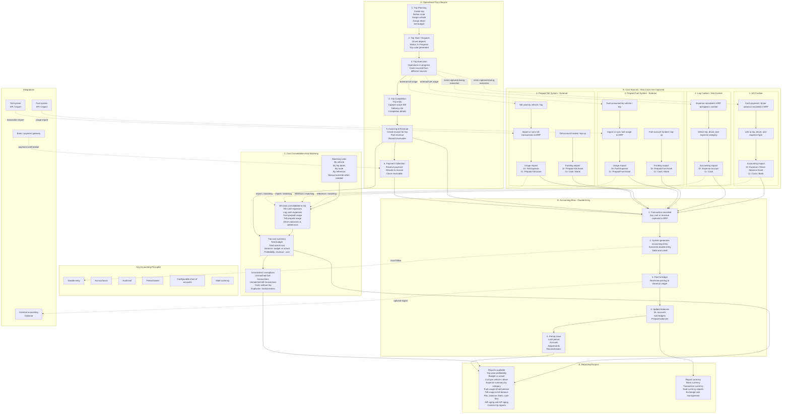

# Logistics ERP Architecture

This document converts the source architecture photo into a Mermaid diagram that can be versioned and refined as the system design evolves.

Source image: [architecture.jpeg](architecture.jpeg)

## Operational And Accounting Workflow

## Architecture Notes

- Every transaction must have a clear source, an optional trip reference, and a defined accounting impact.
- Trip planning and budgeting do not normally post accounting entries; approved operational, prepaid, revenue, and payment transactions do.
- Fuel and toll usage should be matched to trips by vehicle, date range, route, reference, or controlled manual override.
- Unmatched imported transactions must remain visible as exceptions until resolved.
- Reports must reconcile operational trip costs with the General Ledger, sub-ledgers, prepaid balances, and multi-currency reporting.
